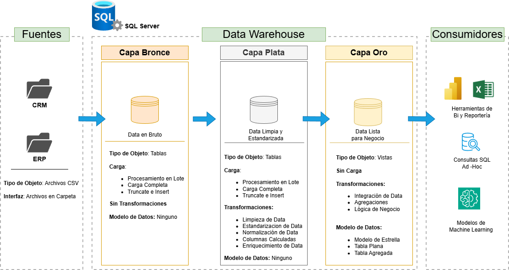
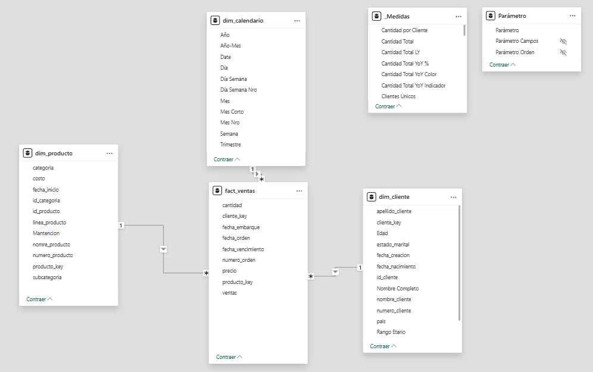
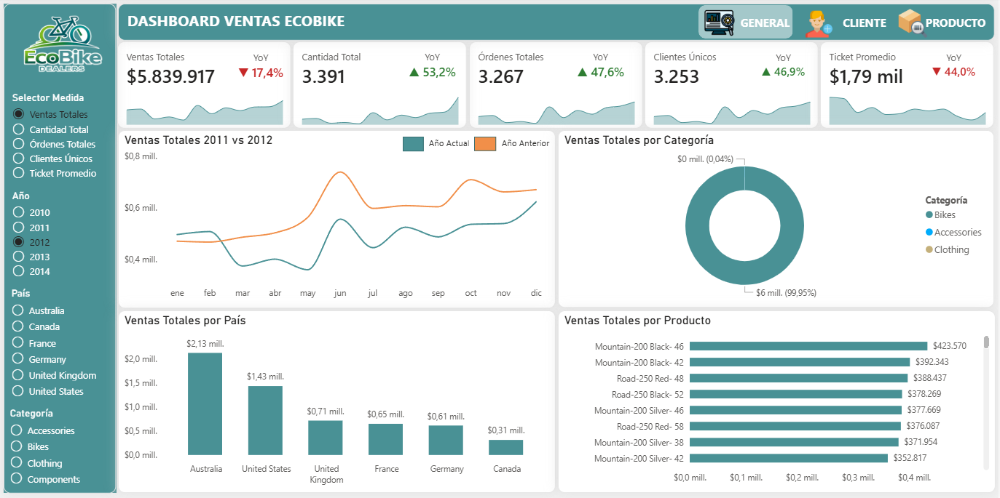
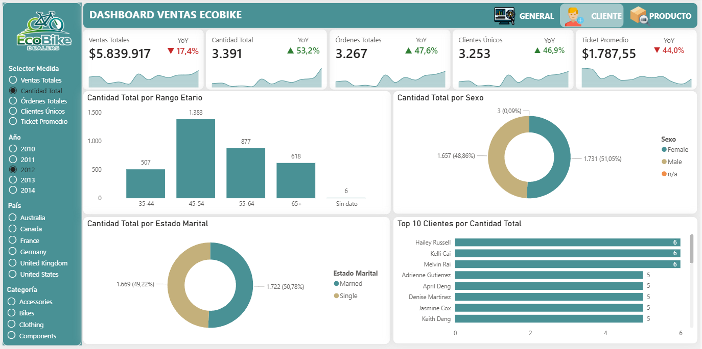
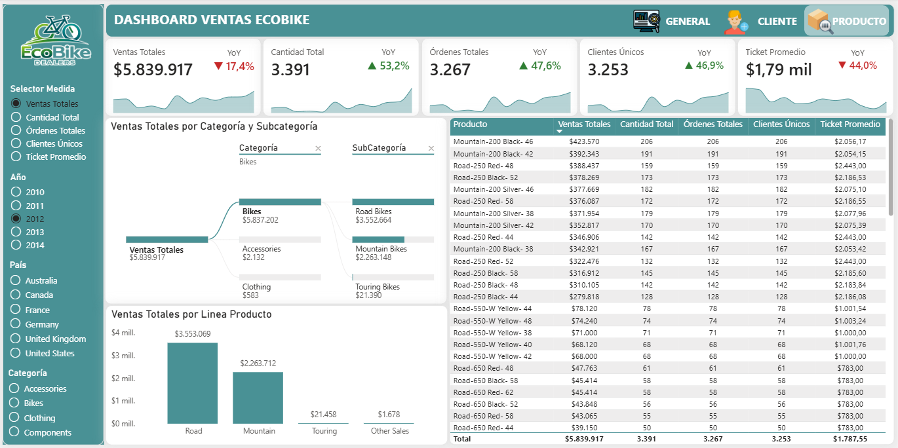

# 🏗️ Proyecto SQL Server Data Warehouse + Power BI

Construcción de una solución **End-to-End de Business Intelligence** utilizando **SQL Server** y **Power BI**, abarcando desde la creación de un **Data Warehouse moderno por capas** hasta el consumo de la **capa oro** en un reporte analítico e interactivo.

Este proyecto contempla:

- Diseño e implementación de un **Data Warehouse** con arquitectura por capas.
- Procesos de **ETL** para carga, limpieza, transformación e integración de datos.
- Modelado dimensional para análisis.
- Construcción de un **dashboard interactivo en Power BI** alimentado desde la capa **gold/oro**.
- Desarrollo de visualizaciones orientadas a análisis de **ventas, clientes y productos**.

---

## 📌 Descripción General del Proyecto

El objetivo de este proyecto es simular una solución moderna de analítica empresarial, cubriendo el ciclo completo del dato:

**Fuentes → Data Warehouse por capas → Modelo analítico → Dashboard en Power BI**

A nivel funcional, el proyecto permite:

- Integrar datos provenientes de múltiples fuentes.
- Estandarizar y depurar la información.
- Construir una capa analítica orientada a negocio.
- Explotar la información mediante un reporte ejecutivo e interactivo en Power BI.

---

## 🏗️ Arquitectura de Datos

La arquitectura de datos de este proyecto sigue el enfoque **Medallion Architecture**, organizado en las capas **Bronce**, **Plata** y **Oro**:



---

## 📌 Consideraciones Generales

### 🔤 Convención de nombres
Se utilizará la convención **snake_case**, es decir:

- Letras en minúsculas
- Separación de palabras mediante guion bajo (`_`)

**Ejemplos:**
- `dim_productos`
- `fecha_orden`
- `precio_unitario`

### 🌎 Idioma
Todo el proyecto utilizará **nomenclatura en español**, tanto en objetos como en documentación, siempre que sea compatible con buenas prácticas técnicas.  
Como el dataset fuente se encuentra en inglés, se generaron nombres de columnas descriptivas en español en las vistas y estructuras analíticas de SQL Server dentro de la capa oro.

### ⚠️ Palabras reservadas
Se debe **evitar el uso de palabras reservadas de SQL** como nombres de tablas, columnas, vistas, procedimientos almacenados u otros objetos.

---

## 🧱 Convenciones para el nombramiento de tablas

### 🥉 Capa Bronze
En la capa **Bronze**, los nombres de las tablas deben comenzar con el nombre del sistema de origen y mantener el nombre original de la entidad sin renombrarla.

**Estructura:**

`<sistema_origen>_<entidad>`

**Donde:**
- `<sistema_origen>`: nombre del sistema fuente, por ejemplo: `crm`, `erp`, `sales`, etc.
- `<entidad>`: nombre original de la tabla en el sistema fuente

**Ejemplos:**
- `erp_info_clientes`
- `crm_ventas`
- `erp_productos`

> 📍 Objetivo: conservar la trazabilidad y fidelidad respecto al sistema de origen.

### 🥈 Capa Silver
En la capa **Silver**, los nombres de las tablas también deben comenzar con el nombre del sistema de origen y conservar el nombre original de la entidad.

**Estructura:**

`<sistema_origen>_<entidad>`

**Donde:**
- `<sistema_origen>`: nombre del sistema fuente
- `<entidad>`: nombre original de la tabla procesada

**Ejemplos:**
- `erp_info_clientes`
- `crm_ventas`
- `erp_productos`

> 📍 Objetivo: mantener consistencia entre Bronze y Silver, facilitando el seguimiento del linaje de datos.

### 🥇 Capa Oro
En la capa **Gold**, los nombres deben ser descriptivos y alineados a la lógica de negocio, utilizando un prefijo según el tipo de tabla.

**Estructura:**

`<categoria>_<entidad>`

**Donde:**
- `<categoria>`: rol de la tabla dentro del modelo analítico
  - `dim` → tabla de dimensión
  - `fact` → tabla de hechos
- `<entidad>`: nombre funcional y descriptivo de la entidad de negocio

**Ejemplos:**
- `dim_clientes`
- `dim_productos`
- `fact_ventas`

> 📍 Objetivo: facilitar el entendimiento del modelo dimensional para análisis y reportería.

---

## 🧾 Convenciones para el nombramiento de columnas

### 🔑 Llaves surrogadas
Todas las **Primary Keys (PK)** de las tablas dimensionales deben utilizar el sufijo `_key`.

**Estructura:**

`<nombre_tabla>_key`

**Ejemplos:**
- `cliente_key`
- `producto_key`
- `tiempo_key`

> 📍 Estas columnas representan llaves surrogadas generadas internamente en el Data Warehouse.

### 🛠️ Columnas técnicas
Todas las columnas técnicas o de metadata deben comenzar con el prefijo `dwh_`, seguido de un nombre descriptivo.

**Estructura:**

`dwh_<nombre_columna>`

**Ejemplos:**
- `dwh_fecha_carga`
- `dwh_fecha_actualizacion`
- `dwh_origen_registro`

**Propósito:**
- Registrar metadata del proceso de carga
- Facilitar auditoría y trazabilidad
- Apoyar controles de calidad y seguimiento de ETL

---

## ⚙️ Convenciones para procedimientos almacenados

Todos los procedimientos almacenados utilizados para la carga de datos deben seguir una convención simple y consistente.

**Estructura:**

`carga_<capa>`

**Donde:**
- `<capa>`: representa la capa objetivo del proceso de carga

**Ejemplos:**
- `carga_bronce`
- `carga_plata`
- `carga_oro`

> 📍 Esta nomenclatura permite identificar rápidamente el propósito del procedimiento y la capa que alimenta.

---

## ✅ Resumen de estándares

| Elemento | Convención |
|----------|------------|
| Tablas Bronze | `<sistema_origen>_<entidad>` |
| Tablas Silver | `<sistema_origen>_<entidad>` |
| Tablas Gold | `<categoria>_<entidad>` |
| Llaves surrogadas | `<nombre_tabla>_key` |
| Columnas técnicas | `dwh_<nombre_columna>` |
| Procedimientos ETL | `carga_<capa>` |

---

## 🎯 Objetivo de estas convenciones

Estas reglas de nombramiento buscan:

- Mantener la **consistencia** en todo el proyecto
- Facilitar la **lectura y mantenimiento** del código
- Mejorar la **trazabilidad** entre capas
- Alinear el modelo con buenas prácticas de **Data Warehousing**
- Hacer que el proyecto sea más **escalable y profesional**

---

## 🧠 Modelo Analítico

La capa **oro/gold** fue diseñada para ser consumida directamente por herramientas de análisis y visualización, siguiendo un enfoque de **modelo estrella**.

### Tablas principales del modelo:
- `fact_ventas`
- `dim_cliente`
- `dim_producto`
- `dim_calendario`

### Características del modelo:
- Separación entre hechos y dimensiones.
- Uso de **llaves sustitutas** para mejorar la integración analítica.
- Tabla calendario para habilitar inteligencia de tiempo.
- Modelo orientado al análisis de:
  - ventas
  - clientes
  - productos
  - comparativas temporales



---

## 📊 Power BI - Reporte Analítico

La capa **oro** del Data Warehouse fue consumida en **Power BI** para construir un dashboard interactivo orientado a análisis ejecutivo y exploratorio.

El reporte fue diseñado bajo una lógica de navegación por páginas y análisis temático, permitiendo explorar el negocio desde tres perspectivas:

- **General**
- **Cliente**
- **Producto**

---

## 📋 Requerimientos del Reporte

El reporte fue construido para responder los siguientes requerimientos funcionales y analíticos:

### 1. Vista General del negocio
- Mostrar indicadores clave de desempeño:
  - Ventas Totales
  - Cantidad Total
  - Órdenes Totales
  - Clientes Únicos
  - Ticket Promedio
- Comparar el desempeño del año seleccionado contra el año anterior (**YoY**).
- Permitir análisis por:
  - país
  - categoría
  - producto
- Incorporar navegación intuitiva entre páginas del reporte.

### 2. Vista de Clientes
- Analizar el comportamiento de clientes según:
  - rango etario
  - sexo
  - estado marital
- Identificar los clientes con mejor desempeño según la métrica seleccionada.
- Permitir cambiar dinámicamente la métrica analizada sin reconstruir visuales.

### 3. Vista de Productos
- Analizar el desempeño de productos desde una perspectiva jerárquica:
  - categoría
  - subcategoría
  - línea de producto
  - producto
- Permitir exploración detallada mediante:
  - árbol de descomposición
  - tabla analítica
  - gráfico resumen por línea de producto

### 4. Interactividad y experiencia de usuario
- Incorporar segmentadores globales para:
  - año
  - país
  - categoría
- Implementar un **selector de medida dinámico** para alternar entre:
  - Ventas Totales
  - Cantidad Total
  - Órdenes Totales
  - Clientes Únicos
  - Ticket Promedio
- Utilizar **títulos dinámicos**, **formato dinámico** y comparativas YoY para mejorar la interpretación del usuario final.

---

## ⚙️ Funcionalidades implementadas en Power BI

El reporte incorpora varias funcionalidades orientadas a mejorar la experiencia de análisis:

- Modelo conectado a la capa **gold/oro** del Data Warehouse.
- Medidas DAX para cálculo de:
  - KPIs principales
  - comparación contra año anterior (LY)
  - variación porcentual YoY
- Uso de **Field Parameters** para selector de métricas.
- Uso de **Dynamic Format Strings** para adaptar el formato según la medida seleccionada.
- Títulos dinámicos según el contexto de análisis.
- Navegación entre páginas con botones personalizados.
- Tarjetas KPI con indicadores visuales de crecimiento/disminución.
- Visuales orientados tanto a análisis ejecutivo como a exploración detallada.

---

## 🧮 Métricas principales del reporte

Entre las medidas desarrolladas se encuentran:

- `Ventas Totales`
- `Cantidad Total`
- `Órdenes Totales`
- `Clientes Únicos`
- `Ticket Promedio`
- Medidas **LY** (Last Year)
- Medidas **YoY %**
- Indicadores visuales YoY
- Medida dinámica seleccionada mediante parámetro

---

## 🖥️ Estructura del Dashboard

### 🏠 Página 1 - General
En esta página se presenta una vista ejecutiva del negocio, incluyendo:

- KPIs principales del período
- comparación del año actual vs año anterior
- análisis por categoría
- análisis por país
- análisis por producto
- selector de medida dinámico



---

### 👥 Página 2 - Cliente
En esta página se analizan patrones asociados al cliente:

- análisis por rango etario
- análisis por sexo
- análisis por estado marital
- top clientes según la métrica seleccionada



---

### 📦 Página 3 - Producto
En esta página se analiza el desempeño del portafolio de productos:

- árbol de descomposición por categoría y subcategoría
- resumen por línea de producto
- tabla analítica a nivel producto
- navegación jerárquica del portafolio



---

## 🔗 Reporte publicado

**Link del reporte en Power BI Service / publicación web:**  
[Ver reporte en Power BI](https://app.powerbi.com/view?r=eyJrIjoiNmEzM2ZmOGMtNzI3Zi00ZGJmLWE2YjEtNGJhMzI0MDAxMGU0IiwidCI6ImI0OGZlNWNhLTI0ODMtNGU0MC1hNDk4LWVkYWU0ZjQyOGU5ZiJ9)

> Reemplazar este placeholder por el enlace final del reporte publicado, si se desea compartir una versión online.

---

## 🧪 Principales aprendizajes del proyecto

Este proyecto permitió consolidar conocimientos en:

- diseño de arquitectura de datos por capas
- procesos ETL en SQL Server
- modelado dimensional
- integración de múltiples fuentes
- consumo analítico de la capa oro
- desarrollo de dashboards interactivos en Power BI
- uso de DAX para inteligencia de tiempo y métricas dinámicas
- diseño de reportes con foco en usabilidad y narrativa visual

---

## 🛠️ Tecnologías utilizadas

- **SQL Server**
- **T-SQL**
- **Stored Procedures**
- **Power BI**
- **DAX**
- **Draw.io**
- **Git / GitHub**

---

## 📁 Estructura de carpetas

```text
proyecto-sql-server-data-warehouse/
│
├── codigos/                            # Scripts SQL para ETL y transformaciones
│   ├── bronce/                         # Scripts para extraer y cargar datos en bruto
│   ├── plata/                          # Scripts para limpiar y transformar datos
│   ├── oro/                            # Scripts para crear modelos analíticos
│
├── datasets/                           # Datasets en bruto utilizados para el proyecto (datos ERP y CRM)
│
├── documentos/                         # Documentación del proyecto y detalles de arquitectura
│   ├── arquitectura_datos.png
│   ├── catalogo_datos.md
│   ├── flujo_datos.png
│   ├── data_models.drawio
│   ├── integracion_datos.drawio
│   ├── modelo_datos.png
│   ├── [PLACEHOLDER_CAPTURA_GENERAL]
│   ├── [PLACEHOLDER_CAPTURA_CLIENTE]
│   └── [PLACEHOLDER_CAPTURA_PRODUCTO]
│
├── tests/                              # Scripts de prueba y archivos de calidad
│
├── README.md                           # Descripción general del proyecto e instrucciones
└── LICENSE                             # Información de licencia del repositorio
